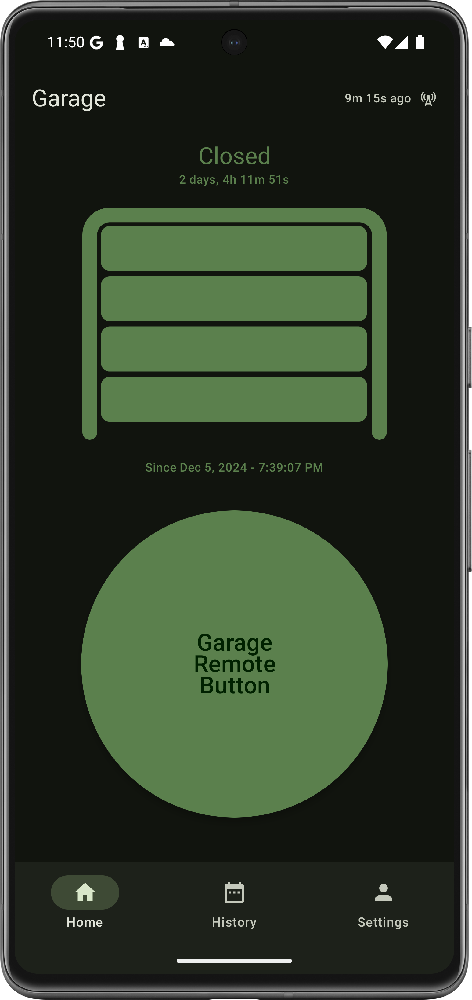

# Android Garage App
I built an Android app to control a garage door.

* UI: Jetpack Compose
* Theme: Material 3
* Navigation: Scaffold, NavHost, TopAppBar, BottomNavigationBar
* Network: Retrofit, Moshi
* Permission State in Compose: Accompanist PermissionState
* Notifications: Firebase Cloud Messaging
* Database: Room
* Auth: Firebase Auth
* Sign-In: Sign in with Google
* Dependency Injection: Hilt



The Android app UI is built entirely in Jetpack Compose.
The basic theme, colors, and typography is based on Material 3.
Composable functions use Hilt to instantiate ViewModel instances for UI state and actions.
The Scaffold and NavHost work directly with the ViewModel instances.
Other than the main app navigation, all other Composable UI can be used without ViewModel.
If a Composable UI can be used with a ViewModel, the Composable extracts UI state
and immediately calls another Composable that does not depend on the ViewModel.
This means all UI elements can be used with basic data for UI state, and lambda for actions.
The ViewModel APIs all hand standalone interfaces with a concrete implementation.
The interface makes the API for the UI clear and deliberate.

Business logic focused on the UI is handled in a ViewModel.
Business logic focused on the data is handled in a Repository.
Network calls are made via a Repository that uses Retrofit.
Data is stored in Room.

Data is pushed to the device with Firebase Cloud Messaging.
The client subscribes to a topic for the garage door.
When the server updates the door event, it sends a silent FCM for the topic.
The FCM Service receives the data and stores it in the database.

The server will send user-visible push notifications if the garage is left open too long.
This also uses Firebase Cloud Messaging, with extra data for the push notification.
On newer versions of Android, users must grant the notification permission.
Permission state is managed with the Compose runtime (does not use a ViewModel or Repository).
The core logic doesn't emit Compose UI, but it is easily consumed by the relevant UI Composable.

Authentication uses Firebase & Google APIs.
Google is the only supposed sign-in method.
The server validates the authentication with its own SDK, so we also use the Firebase Auth APIs.
Step 1: User signs in with Google, which mints a Google ID Token.
Step 2: App uses the Google ID Token credential to sign in, which mints a Firebase ID Token.
Step 3: App sends the Firebase ID Token to the server for user authenticated calls.

Dependency injection is configured with Hilt.

## Android Build
The Android build files are all written in Kotlin. Versions are defined with TOML.
The build file treats `debug` and `release` builds differently.

* All
  * Version Name: Includes the timestamp of the build (to help disambiguate)
  * Filename: Includes package name, flavor, version name (including timestamp), and build type 
* `debug`
  * Appends `.debug` to the package name so it can be installed on the same device
  * Appends `(debug)` to the app name
  * Changes the app icon
* `release`
  * Requires key passwords in `local.properties` or a Gradle command line parameter 

### Required Build Fields
You must configure `local.properties` with the following properties:

* `SERVER_CONFIG_KEY`: Checked by the server. Required to get basic configuration data.
* `GOOGLE_WEB_CLIENT_ID`: NOT the Android client ID.
* `GARAGE_RELEASE_KEYSTORE_PWD`: Keystore password.
* `GARAGE_RELEASE_KEY_PWD`: Key password (Alias "Garage")

```
# local.properties
SERVER_CONFIG_KEY=YourKey
GOOGLE_WEB_CLIENT_ID=YourClientId
# Keystore password and key password are required for release builds
GARAGE_RELEASE_KEYSTORE_PWD=YourKeystorePassword
GARAGE_RELEASE_KEY_PWD=YourKeyPassword
```

## Encrypt and Decrypt the Android secrets

IMPORTANT: DO NOT check in the *.jks files, the passphrase, or passwords.

To make it easier to access the secrets, we encrypt them with `gpg` and check-in the
encrypted `gpg` files. When we need to use the files, we decrypt them.

### Setup gpg
* Install `gpg` https://www.gnupg.org/download/
* On Windows, install WSL https://learn.microsoft.com/en-us/windows/wsl/install

From MacOS Terminal, Linux Bash, or WSL on Windows, run the following commands.

### Decrypt
To use the gpg files, decrypt them with the key.

```
export ENCRYPT_KEY="SecretPassphrase"
release/decrypt-secrets.sh
```

### Encrypt
To record any changes to `google-services.json`, encrypt the files.

```
export ENCRYPT_KEY="SecretPassphrase"
release/encrypt-secrets.sh
```

### Delete the secrets

```
release/clean-secrets.sh
```

## Known Issues

* **Hilt singletons are not single**: There is either a bug in Hilt, or I've configured it incorrectly.
  I am not getting all of the benefits of Hilt because I need to manually track Repository
  instances so that I do not create multiple versions. For example, if I try to use
  AuthRepository in multiple ViewModel instances, the AuthState will not be in sync.
  Some parts of app will think the user is Authenticated, others Unauthenticated.
* **Hilt interface binding not working for ViewModel**: I can use Hilt with my Repository,
  but I cannot use the same technique to inject a concrete implementation for an interface.
* **Notifications are not dismissed when the door closes**: The notification should be updated or
  dismissed when the door is closed.
* **Please Snooze notifications for [time] (feature request)**: Sometimes you leave the door open
  intentionally and do not want to send a push notification. Add a global "snooze" option that
  temporarily increases the time threshold for a notification.
