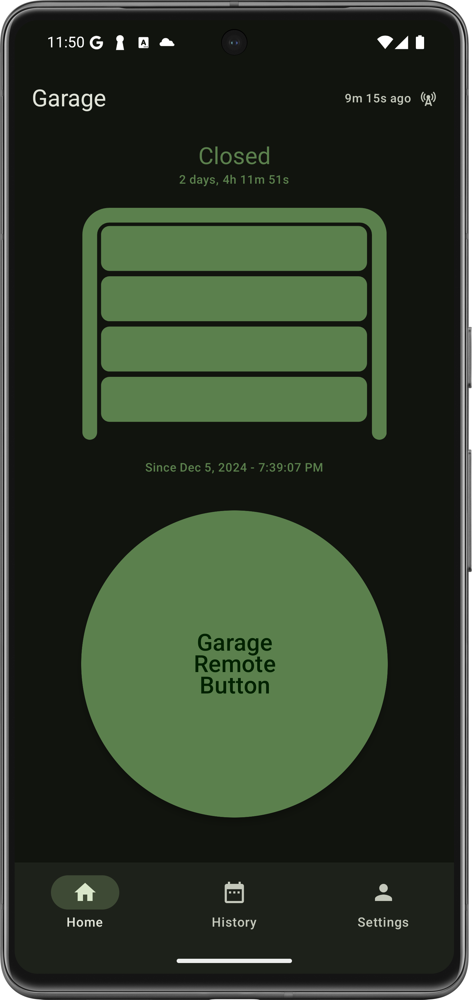
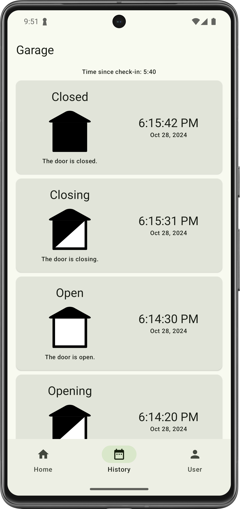

# Smart Garage Door - Android App

## Overview
Android app for monitoring and controlling the garage door remotely. Built with modern Android architecture components and Jetpack Compose.

 

## Features
- Monitor garage door status (open/closed)
- Control garage door remotely with secure authentication
- View door event history
- Receive notifications when door is left open
- Snooze notifications if you're not ready to close the door
- Material 3 design system
- Dark/light theme support

## Technical Stack
- UI: Jetpack Compose with Material 3
- Navigation: Navigation 3 (`NavDisplay` + `entryProvider`, `@Serializable` route objects)
- Network: Ktor HTTP client + kotlinx.serialization (engine selected via KMP `expect/actual`)
- Database: Room (KMP) + DataStore for settings
- Authentication: Firebase Auth, Google Sign-In (Credential Manager)
- Push Notifications: Firebase Cloud Messaging (FCM)
- Dependency Injection: kotlin-inject
- Logging: Kermit (KMP)
- Permissions: Accompanist PermissionState

## Architecture

Shared business logic lives in KMP modules; `androidApp/` is Compose UI + Firebase bridges + DI wiring only. See [`docs/ARCHITECTURE.md`](docs/ARCHITECTURE.md) for the full module graph and data flows.

- **`domain/`** — pure Kotlin model types + repository interfaces
- **`data/`** — data source interfaces, Ktor implementations, platform bridges (`AuthBridge`, `MessagingBridge`), repository implementations
- **`data-local/`** — Room database + DataStore
- **`usecase/`** — UseCases + all 5 ViewModels + app-scoped managers
- **`presentation-model/`** — screen-state data classes
- **`androidApp/`** — Compose UI + Firebase bridge impls + DI wiring + Activity/Application/Service entry points

## Build Configuration
The Android build uses Kotlin build files with version catalogs (TOML).

### Debug vs Release Builds
- All builds include timestamp in version name
- Debug builds:
    - Package name suffix: `.debug`
    - App name suffix: `(debug)`
    - Modified app icon
- Release builds require signing configuration

### Required Properties
Add to `local.properties`:
```properties
SERVER_CONFIG_KEY=YourKey
GOOGLE_WEB_CLIENT_ID=YourClientId
GARAGE_RELEASE_KEYSTORE_PWD=YourKeystorePassword
GARAGE_RELEASE_KEY_PWD=YourKeyPassword
```

## Secrets Management
Project secrets are encrypted using GPG:

1. Install requirements:
   - GPG: https://www.gnupg.org/download/
   - WSL (Windows only): https://learn.microsoft.com/en-us/windows/wsl/install

2. Decrypt secrets:
```sh
export ENCRYPT_KEY="SecretPassphrase"
release/decrypt-secrets.sh
```

3. Encrypt updated secrets:
```sh
export ENCRYPT_KEY="SecretPassphrase"
release/encrypt-secrets.sh
```

4. Clean secrets:
```sh
release/clean-secrets.sh
```

## Known Issues
- **Notification Management**: Not automatically dismissed on door close
