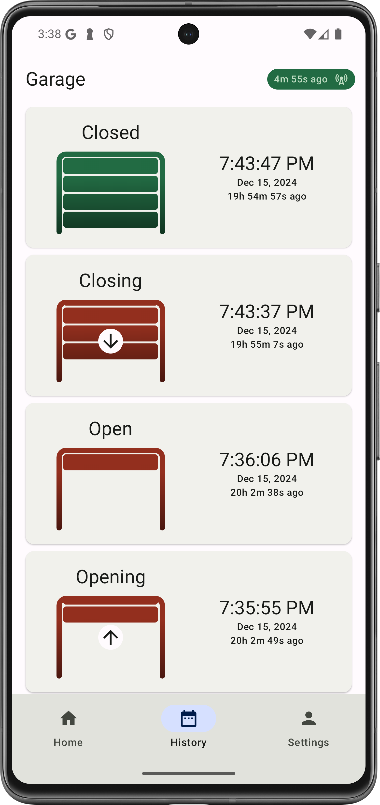

# Smart Garage Door - Android App

## Overview
Android app for monitoring and controlling the garage door remotely. Built with modern Android architecture components and Jetpack Compose.

 

## Features
- Monitor garage door status (open/closed)
- Control garage door remotely with secure authentication
- View door event history
- Receive notifications when door is left open
- Snooze notifications if you're not ready to close the door
- Material 3 design system
- Dark/light theme support

## Technical Stack
- UI: Jetpack Compose with Material 3
- Navigation: Scaffold, NavHost, TopAppBar, BottomNavigationBar
- Network: Retrofit, Moshi
- Database: Room
- Authentication: Firebase Auth, Google Sign-In
- Push Notifications: Firebase Cloud Messaging (FCM)
- Dependency Injection: Hilt
- Permissions: Accompanist PermissionState

## Architecture
- **ViewModels**: Handle UI state and business logic
- **Repositories**: Manage data operations and network calls
- **Room Database**: Store door events and state
- **FCM Service**: Handle push notifications and data updates
- **Authentication**: Two-step process with Google and Firebase tokens

## Build Configuration
The Android build uses Kotlin build files with version catalogs (TOML).

### Debug vs Release Builds
- All builds include timestamp in version name
- Debug builds:
    - Package name suffix: `.debug`
    - App name suffix: `(debug)`
    - Modified app icon
- Release builds require signing configuration

### Required Properties
Add to `local.properties`:
```properties
SERVER_CONFIG_KEY=YourKey
GOOGLE_WEB_CLIENT_ID=YourClientId
GARAGE_RELEASE_KEYSTORE_PWD=YourKeystorePassword
GARAGE_RELEASE_KEY_PWD=YourKeyPassword
```

## Secrets Management
Project secrets are encrypted using GPG:

1. Install requirements:
   - GPG: https://www.gnupg.org/download/
   - WSL (Windows only): https://learn.microsoft.com/en-us/windows/wsl/install

2. Decrypt secrets:
```sh
export ENCRYPT_KEY="SecretPassphrase"
release/decrypt-secrets.sh
```

3. Encrypt updated secrets:
```sh
export ENCRYPT_KEY="SecretPassphrase"
release/encrypt-secrets.sh
```

4. Clean secrets:
```sh
release/clean-secrets.sh
```

## Known Issues
- **Notification Management**: Not automatically dismissed on door close
