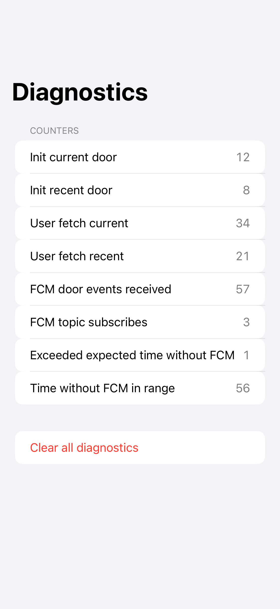
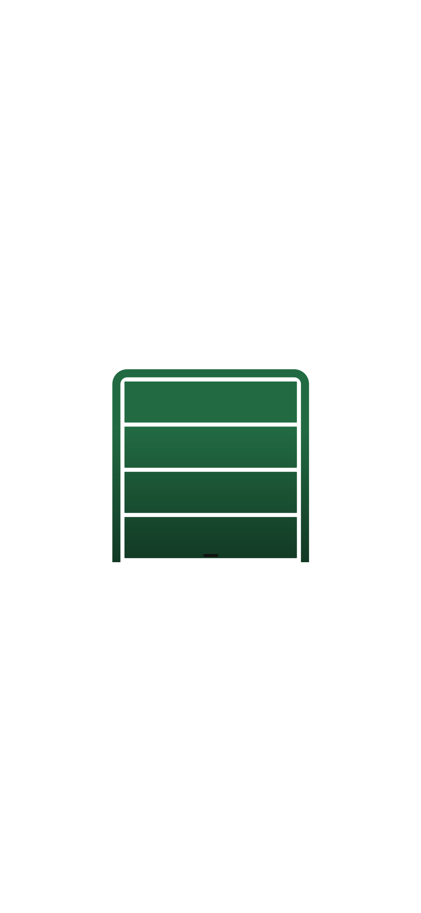
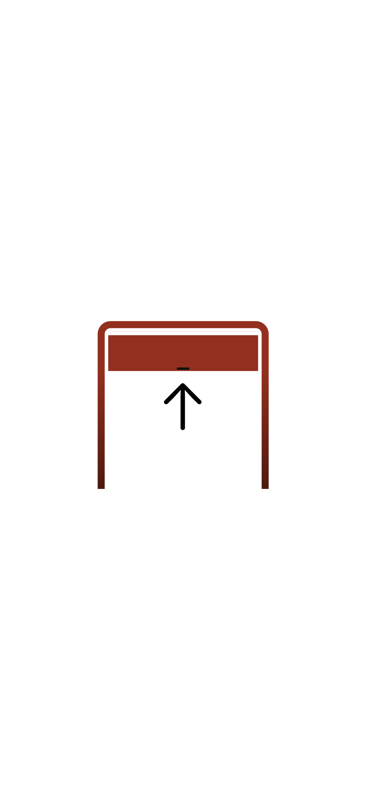
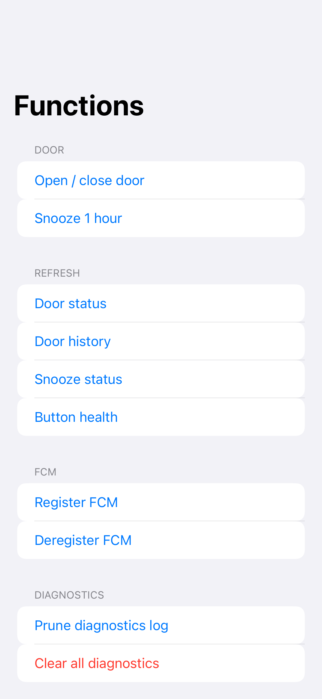
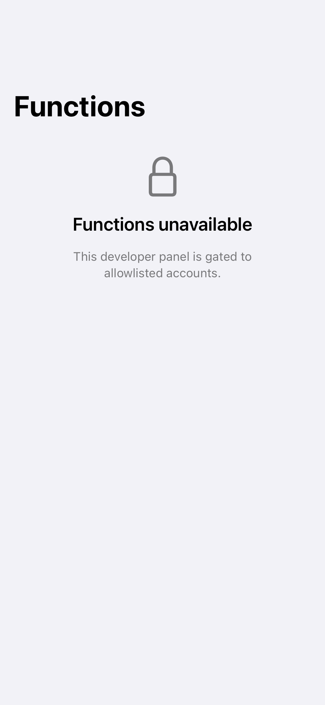
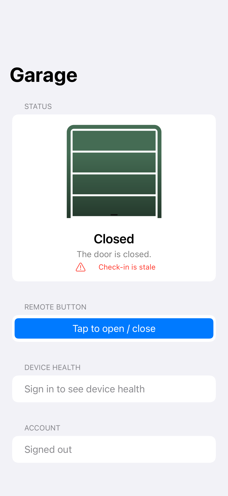
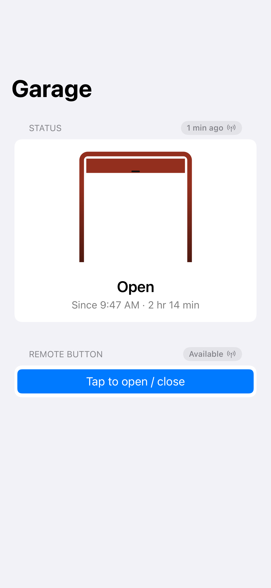
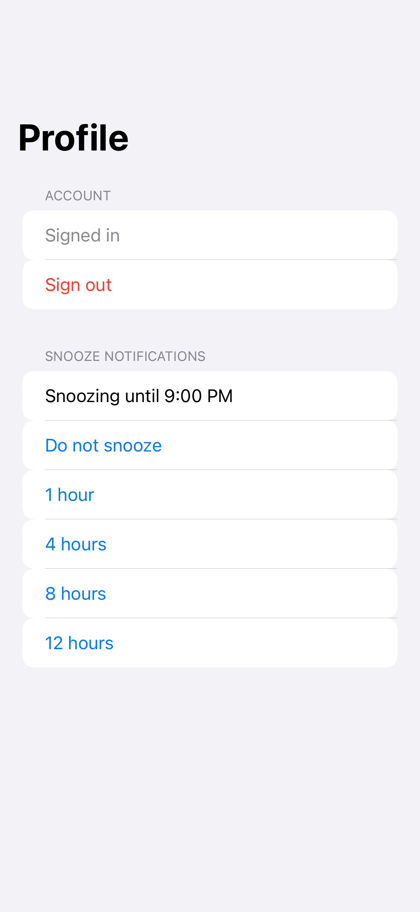
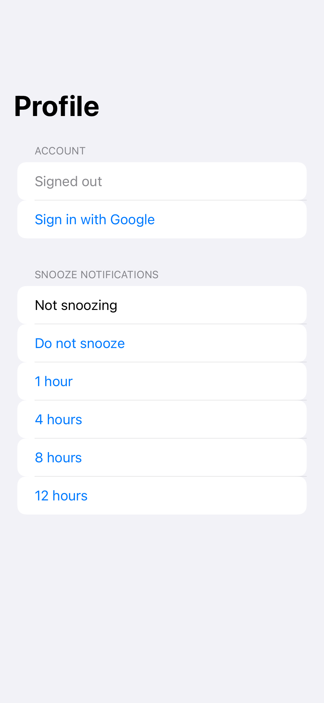

<!-- GENERATED FILE - DO NOT EDIT -->
<!-- Regenerate: ./scripts/generate-ios-screenshots.sh -->

# iOS Screenshot Gallery

A browsable visual reference of every SwiftUI `#Preview` in the iOS app, captured via Prefire + swift-snapshot-testing. These are reference images, **not** pixel-perfect gating tests — they are regenerated, never asserted.

**10 snapshot(s)** across 1 group(s).

## Table of contents
- [PreviewTests.generated](#previewtestsgenerated)

## PreviewTests.generated

### Diagnostics-counters.1

### Door-closed.1

### Door-opening.1

### Door-states.1

### Functions-granted.1

### Functions-locked.1

### Home-closed-signed-out.1

### Home-open-signed-in.1

### Profile-signed-in-snoozing.1

### Profile-signed-out.1

