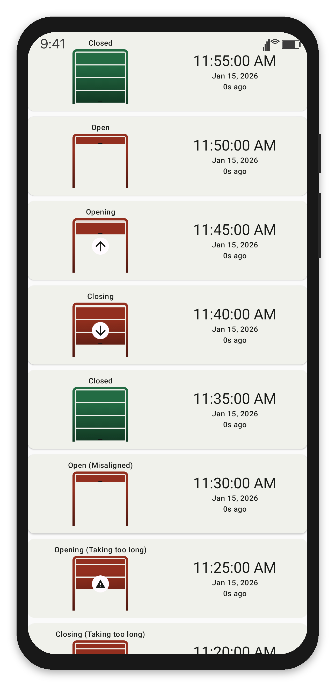
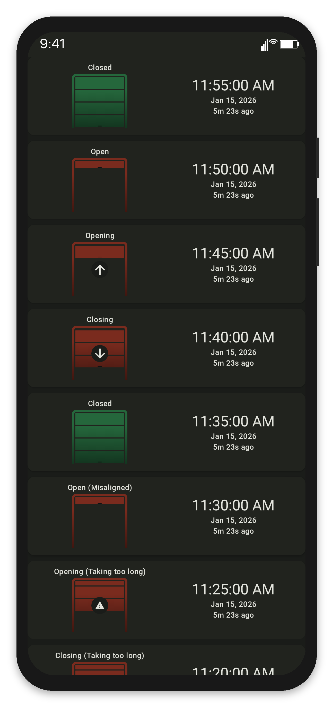
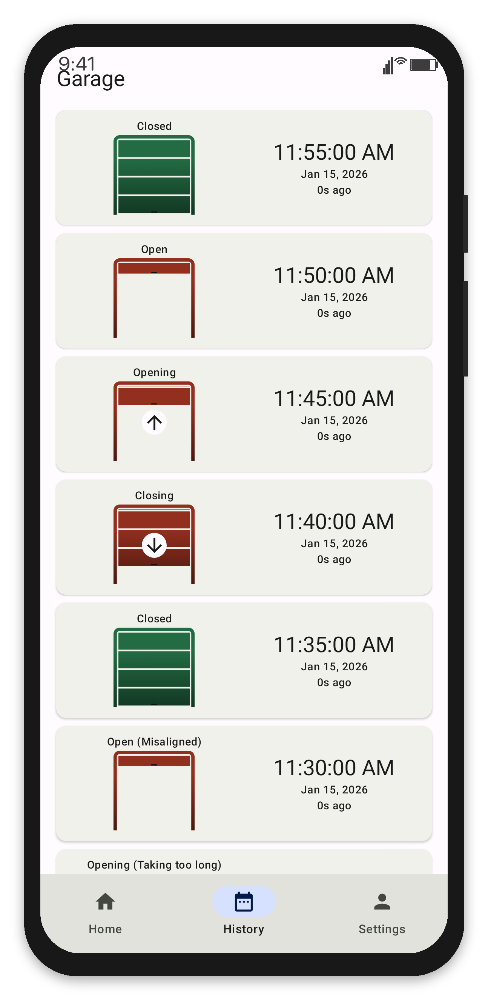
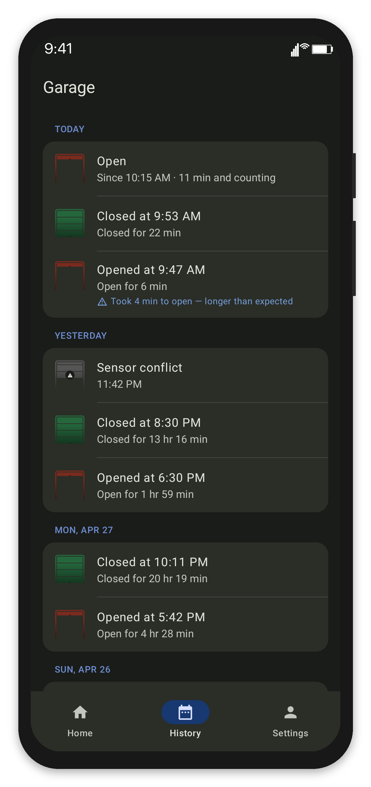
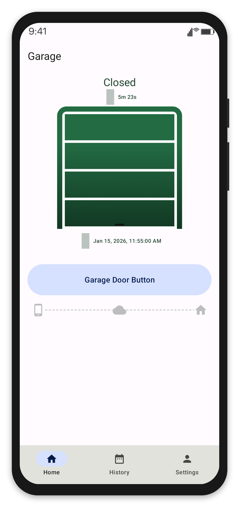
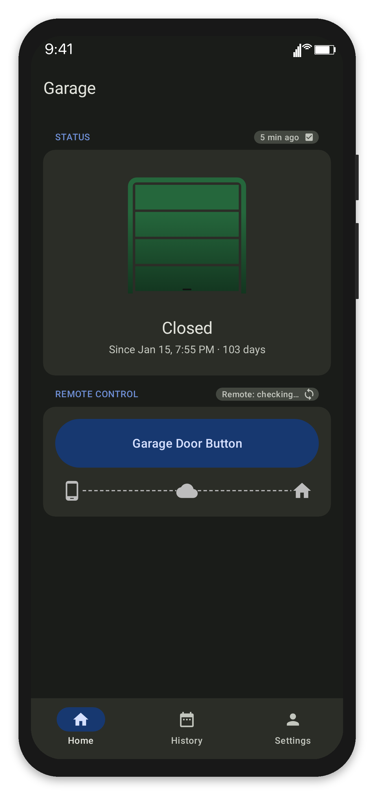
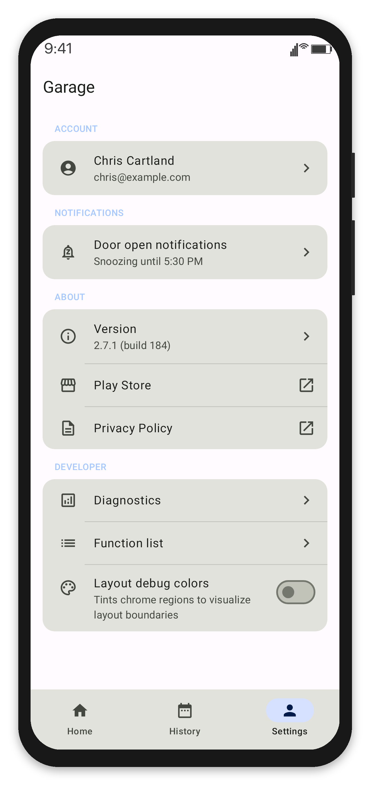
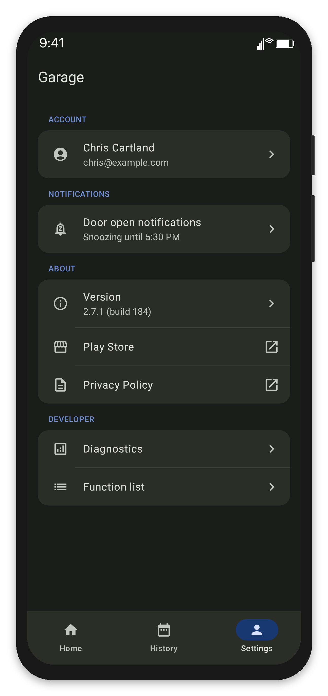

<!-- GENERATED FILE — DO NOT EDIT -->
<!-- Source: scripts/framed-screenshots.txt (regenerated by frame-screenshot.py --batch) -->

# Framed Screenshots

8 framed screenshots from `scripts/framed-screenshots.txt`. 
Re-rendered on every `./scripts/generate-android-screenshots.sh` run.

## Door History

 

## History Tab

 

## Home Tab

 

## Settings Tab

 
