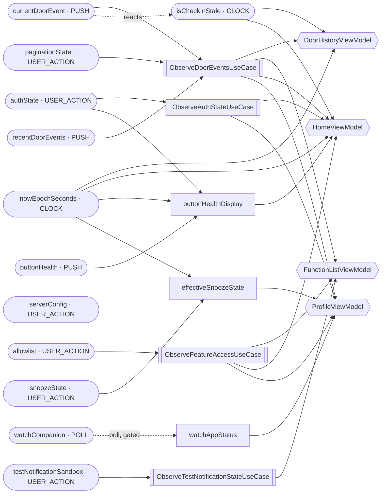

<!-- GENERATED from sources by DataGraphExtractionKonsistTest — do not edit.
     Regenerate: ./scripts/generate-data-graph.sh
     The same test pins this file byte-exact to the code (DATA_GRAPH_PLAN.md §6). -->

# Shared data graph

| Node | Kind | Cadence | Declared by | Sharing | Read by |
|---|---|---|---|---|---|
| `authState` | input | USER_ACTION | `AuthRepository` | — | `HomeViewModel` (invoke), `ProfileViewModel` (invoke) |
| `currentDoorEvent` | input | PUSH | `DoorRepository` | — | `FunctionListViewModel` (current), `HomeViewModel` (current, position), `ProfileViewModel` (current) |
| `recentDoorEvents` | input | PUSH | `DoorRepository` | — | `DoorHistoryViewModel` (recent) |
| `paginationState` | input | USER_ACTION | `DoorRepository` | — | `DoorHistoryViewModel` (paginationState) |
| `buttonHealth` | input | PUSH | `ButtonHealthRepository` | — | — |
| `snoozeState` | input | USER_ACTION | `SnoozeRepository` | — | — |
| `serverConfig` | input | USER_ACTION | `ServerConfigRepository` | — | — |
| `allowlist` | input | USER_ACTION | `FeatureAllowlistRepository` | — | `FunctionListViewModel` (functionList), `HomeViewModel` (developer), `ProfileViewModel` (developer, functionList) |
| `testNotificationSandbox` | input | USER_ACTION | `TestNotificationRepository` | — | `FunctionListViewModel` (invoke) |
| `nowEpochSeconds` | input | CLOCK | `LiveClock` | — | `DoorHistoryViewModel` (direct), `HomeViewModel` (direct) |
| `isCheckInStale` | input | CLOCK | `CheckInStalenessManager` | — | `DoorHistoryViewModel` (direct), `HomeViewModel` (direct) |
| `watchCompanion` | input | POLL | `WearCompanionRepository` | — | — |
| `buttonHealthDisplay` | derived | — | `ComputeButtonHealthDisplayUseCase` | eager | `HomeViewModel` |
| `effectiveSnoozeState` | derived | — | `ComputeEffectiveSnoozeStateUseCase` | eager | `ProfileViewModel` |
| `watchAppStatus` | derived | — | `ObserveWatchAppStatusUseCase` | gated on `watchCompanion` | `ProfileViewModel` |

**Cadence** — what makes a value change. `USER_ACTION`: written only when
the user or the app explicitly acts (a tap, a fetch). `PUSH`:
server-initiated (FCM), can land at any time. `POLL`: a fixed-interval
collection loop, the only cadence that justifies gating. `CLOCK`: an
always-on tick.

**Read by** — the screens that reactively observe each value, with the
conduit method in parentheses (`direct` = an injected manager or value).
A dash means no screen observes it: the value feeds a derived node (see
diagram) or is consumed at action time inside the data layer.
`DiagnosticsViewModel` reads no graph nodes; Wear wires a subset of the
inputs and none of the derived nodes.

**Diagram legend** — `([x])` input (cadence-labeled) · `[x]` derived
(`stateIn` UseCase) · `[[X]]` conduit (ADR-022 pass-through) · `{{X}}`
screen ViewModel · `-. reacts .->` a manager's reactive upstream ·
`-. poll, gated .->` a gated poll. Conduit → ViewModel edges are
class-level; the table's Read by column is the per-value truth.
