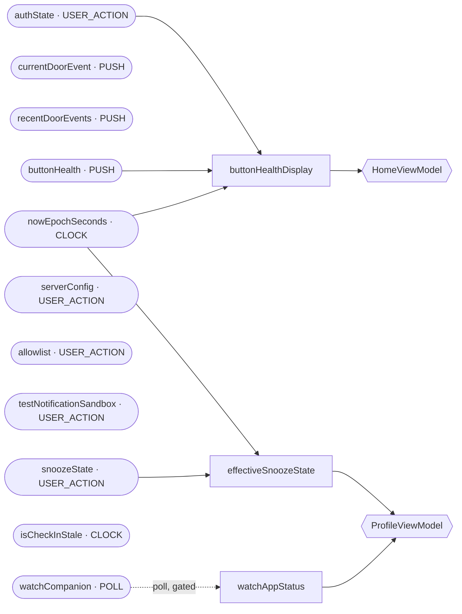

<!-- GENERATED from sources by DataGraphExtractionKonsistTest — do not edit.
     Regenerate: ./scripts/generate-data-graph.sh
     The same test pins this file byte-exact to the code (DATA_GRAPH_PLAN.md §6). -->

# Shared data graph

| Node | Kind | Cadence | Declared by | Sharing | Read by |
|---|---|---|---|---|---|
| `authState` | input | USER_ACTION | `AuthRepository` | — | — |
| `currentDoorEvent` | input | PUSH | `DoorRepository` | — | — |
| `recentDoorEvents` | input | PUSH | `DoorRepository` | — | — |
| `buttonHealth` | input | PUSH | `ButtonHealthRepository` | — | — |
| `snoozeState` | input | USER_ACTION | `SnoozeRepository` | — | — |
| `serverConfig` | input | USER_ACTION | `ServerConfigRepository` | — | — |
| `allowlist` | input | USER_ACTION | `FeatureAllowlistRepository` | — | — |
| `testNotificationSandbox` | input | USER_ACTION | `TestNotificationRepository` | — | — |
| `nowEpochSeconds` | input | CLOCK | `LiveClock` | — | — |
| `isCheckInStale` | input | CLOCK | `CheckInStalenessManager` | — | — |
| `watchCompanion` | input | POLL | `WearCompanionRepository` | — | — |
| `buttonHealthDisplay` | derived | — | `ComputeButtonHealthDisplayUseCase` | eager | `HomeViewModel` |
| `effectiveSnoozeState` | derived | — | `ComputeEffectiveSnoozeStateUseCase` | eager | `ProfileViewModel` |
| `watchAppStatus` | derived | — | `ObserveWatchAppStatusUseCase` | gated on `watchCompanion` | `ProfileViewModel` |

