# Play Store assets (generated — latest)

Auto-generated; do not hand-edit. Regenerated by the screenshot pipeline
(`./scripts/generate-android-screenshots.sh`) + `MobileGarage/distribution/playstore/generate.sh`.
These are the **candidates**; the curated subset that's live in the store
is copied by hand into `MobileGarage/distribution/playstore/` (see the `play-store-assets` skill).

## Icon & feature graphic

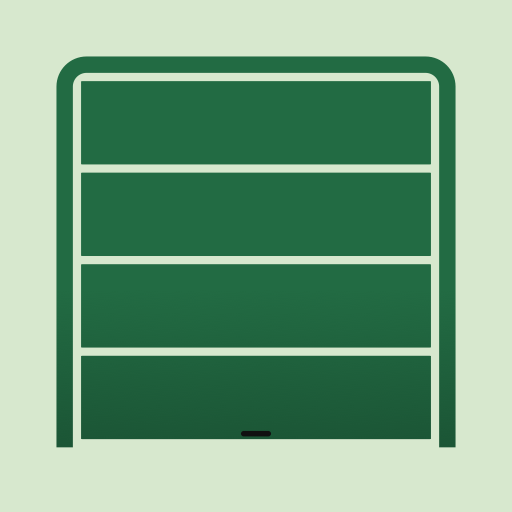

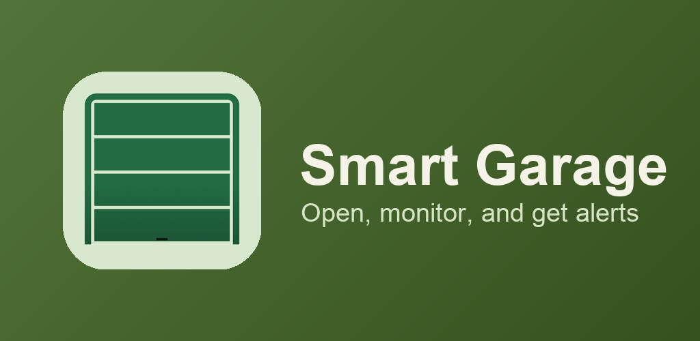

## Phone

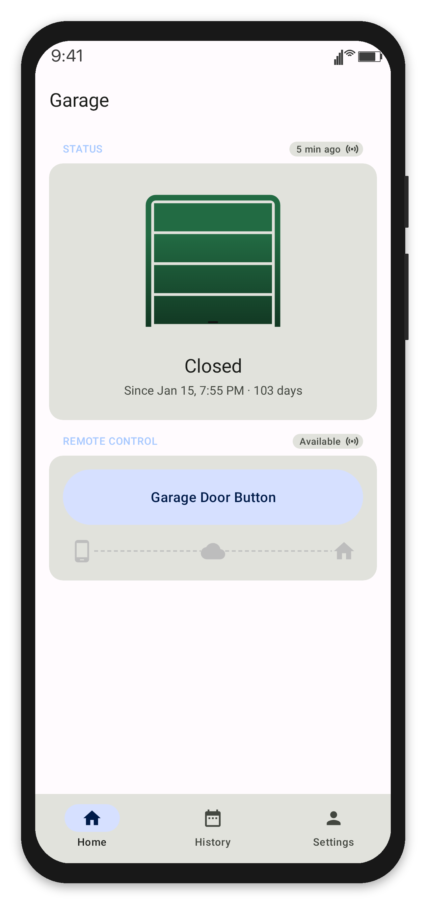 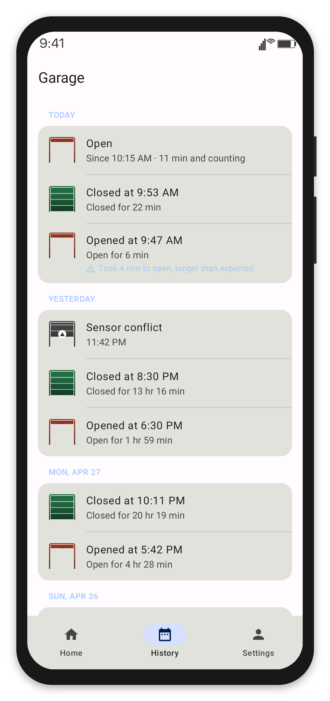 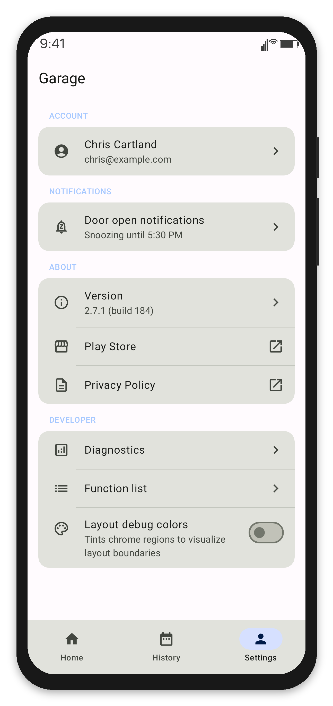 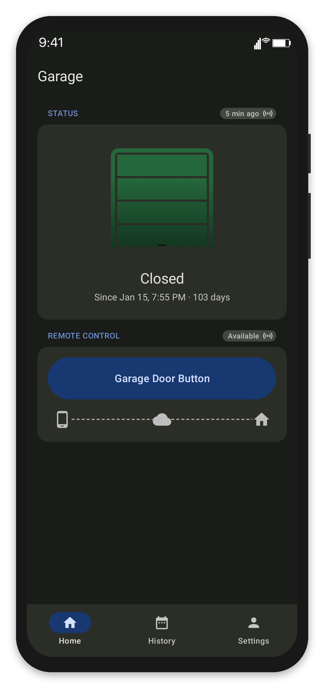 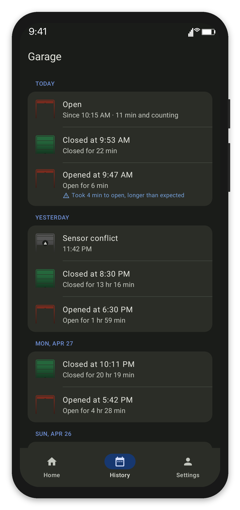 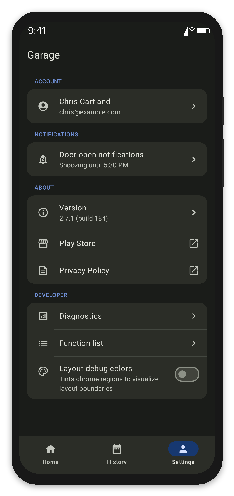

## 7-inch tablet

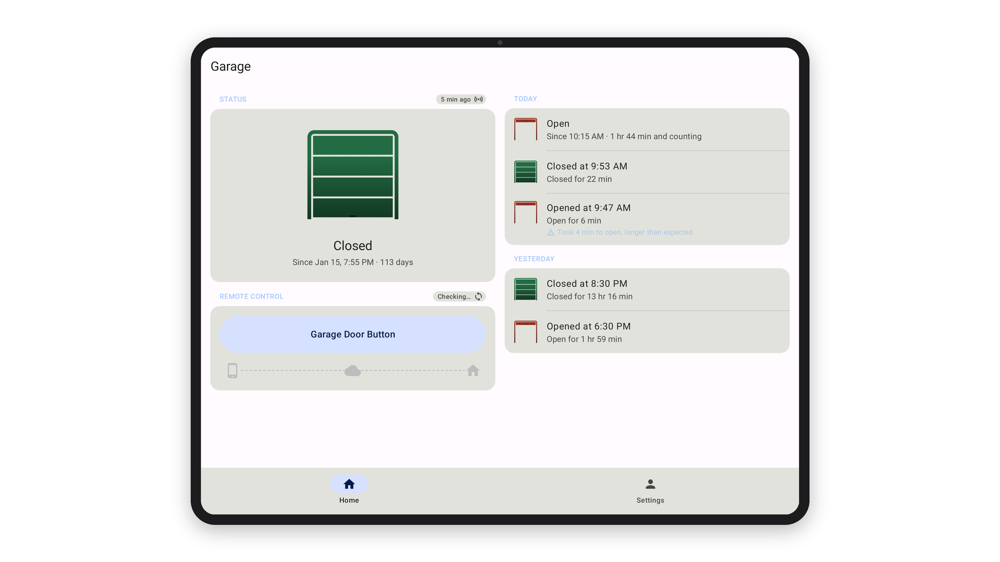 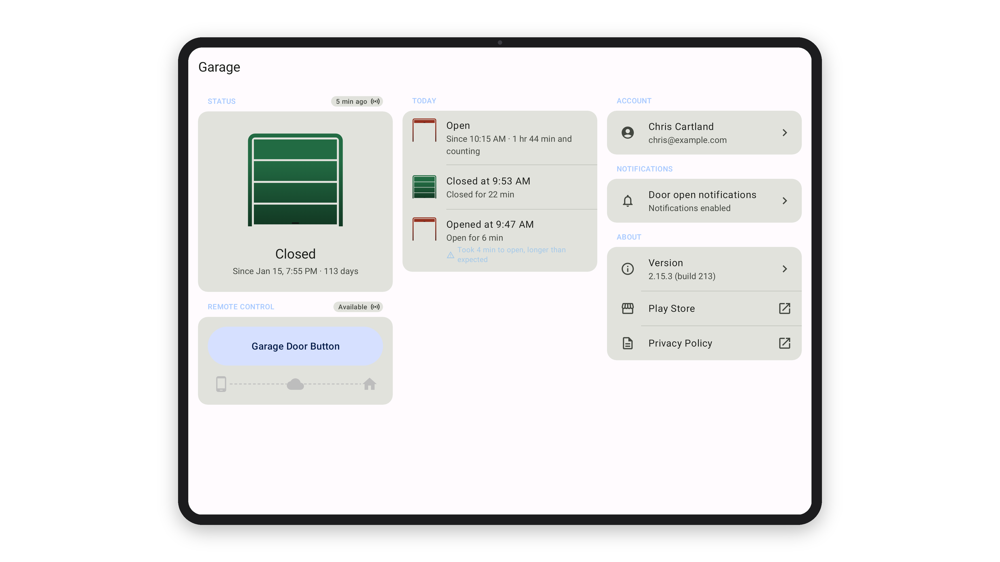 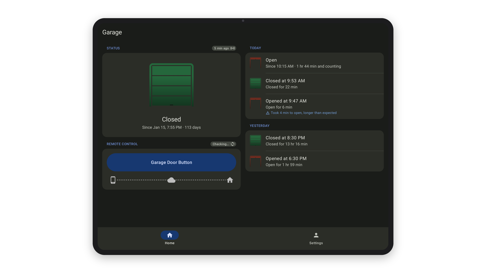 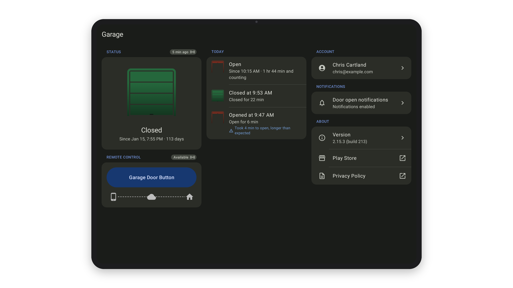

## 10-inch tablet

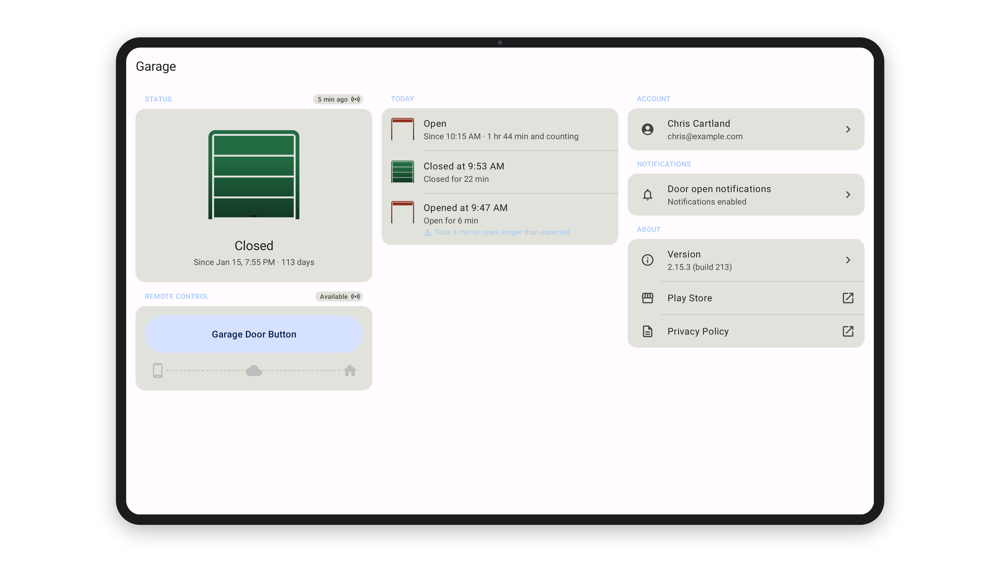 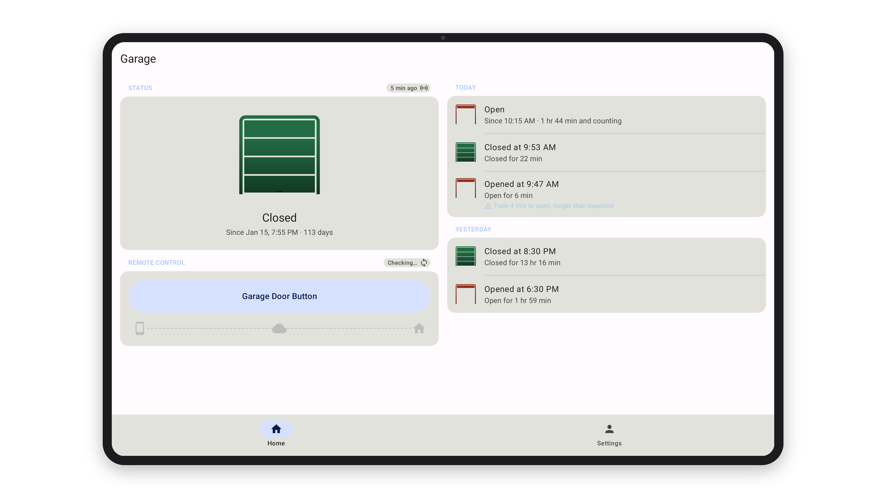 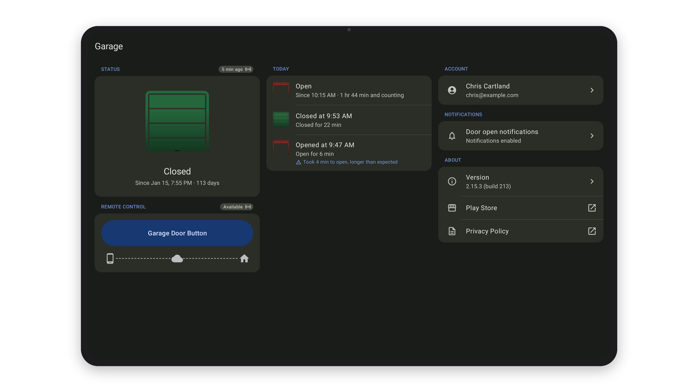 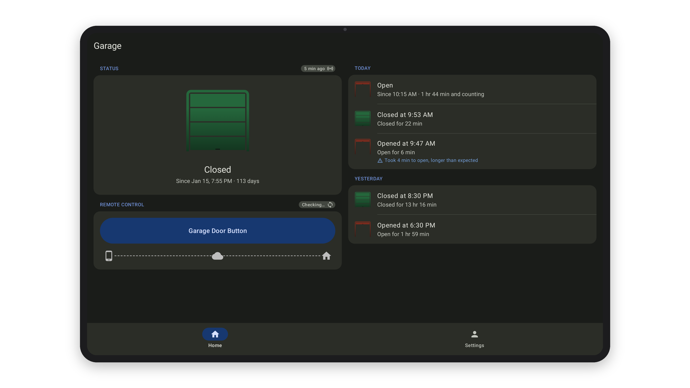
