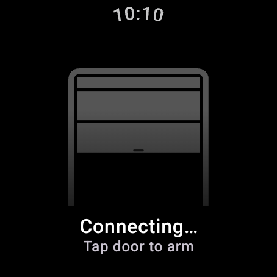
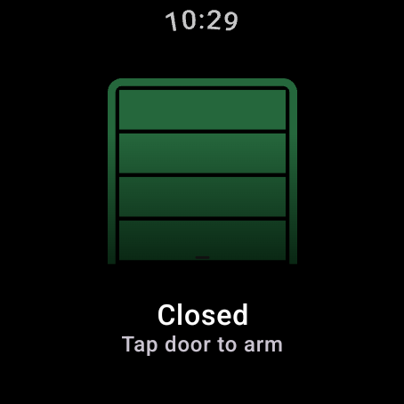
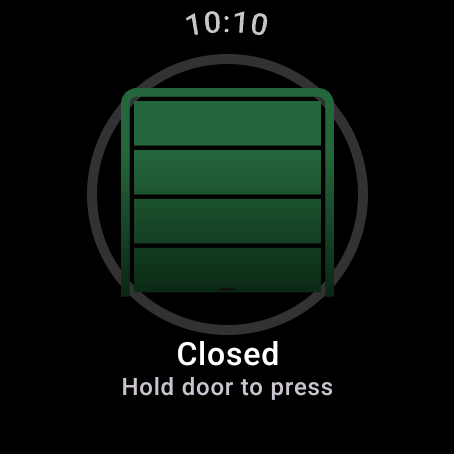
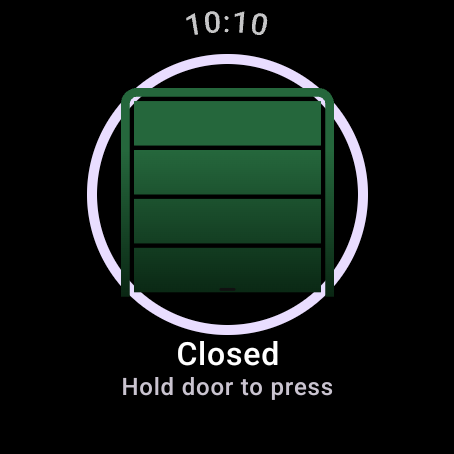
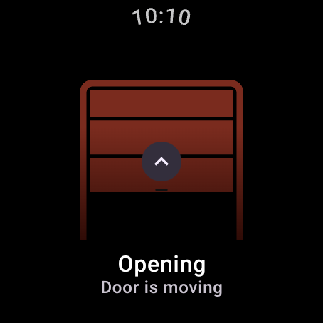
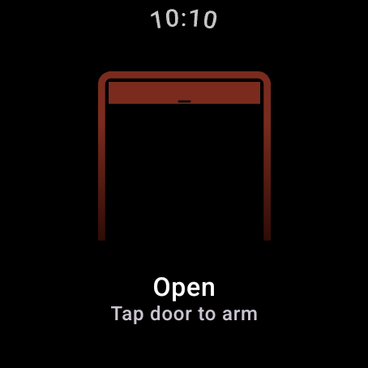
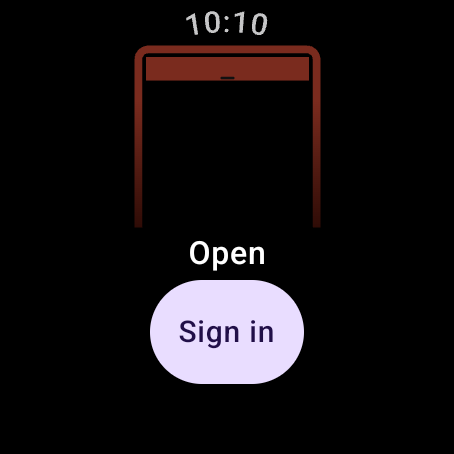
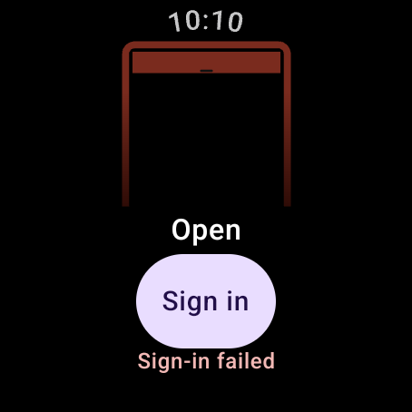

# Wear screenshots (generated — latest)

Auto-generated by `./scripts/generate-wear-screenshots.sh`; do not hand-edit.
Captured from the debug fixture `ScreenshotStagesActivity` on the
`wear_capture` emulator (wearos_large_round, 454×454, API 34 Wear OS image) with the
clock pinned to 10:10. This directory doubles as Play Store staging; the
curated live subset is copied by hand to `../../../distribution/playstore/wear/`.
Captures are byte-stable across regens — a diff means a real visual change.

| Stage | Capture | Shows |
|---|---|---|
| connecting |  | Cold start, no data yet: "Connecting…", no warning badge |
| closed |  | Closed door, "Tap door to arm" |
| armed |  | Armed: faint hold ring, "Hold door to press" |
| holding |  | Hold completing: full radial ring, the instant before the press fires |
| moving |  | Door sliding open, up arrow, "Door is moving" |
| open |  | Open door |
| signed_out |  | Signed out: Sign in button |
| sign_in_error |  | Transient "Sign-in failed" caption |
