# Wear screenshots (generated — latest)

Auto-generated by `./scripts/generate-wear-screenshots.sh`; do not hand-edit.
Captured from the debug fixture `ScreenshotStagesActivity` on the
`wear_capture` emulator (wearos_large_round, 454×454, API 34 Wear OS image) with the
clock pinned to 10:10. This directory doubles as Play Store staging; the
curated live subset is copied by hand to `../../../distribution/playstore/wear/`.

Captures are byte-stable across regens **except the mid-travel stages**
(`moving` and `inferred`, both DoorPosition.OPENING), which are caught
part-way through 12s of door animation against a 4s settle and can differ
by a frame. A diff in any other stage means a real visual change.

| Stage | Capture | Shows |
|---|---|---|
| connecting | 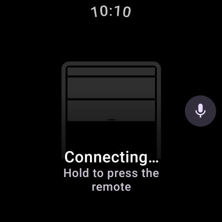 | Cold start, no data yet: "Connecting…", no warning badge |
| closed | 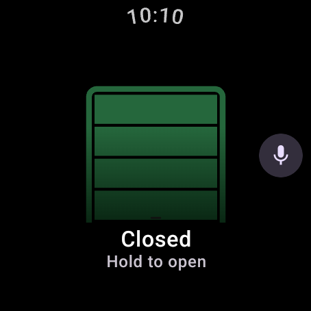 | Closed door (affirmative sensor), "Hold to open" |
| inferred | 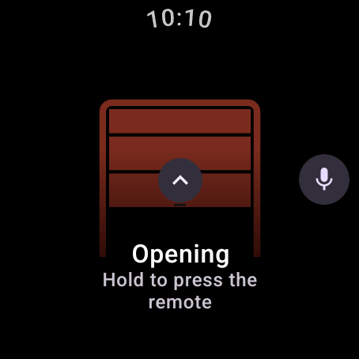 | No affirmative sensor, so no prediction: "Hold to press the remote" |
| holding | 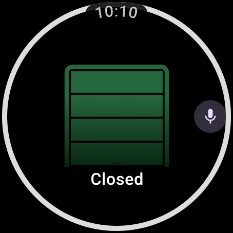 | Hold completing: full radial ring, the instant before the press fires |
| submitted | 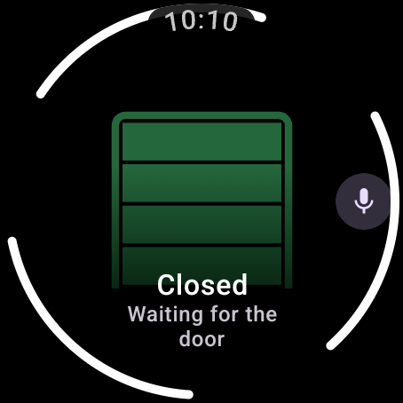 | Press sent: gapped ring rotating while the door is awaited, "Waiting for the door" |
| bloom | 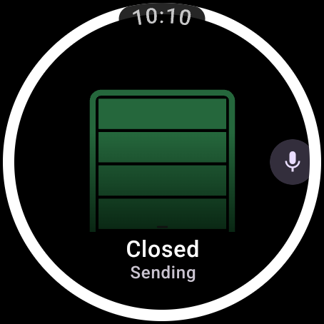 | The commit instant (pinned, not animated): ring thickened inward to fill its reserved band and gone full white, with the door and both labels still readable |
| moving | 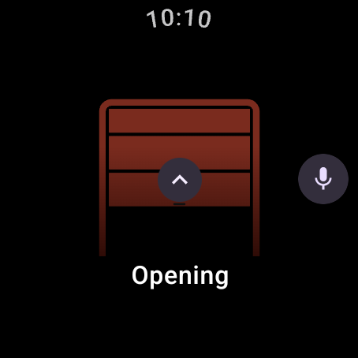 | Door sliding open, up arrow |
| open | 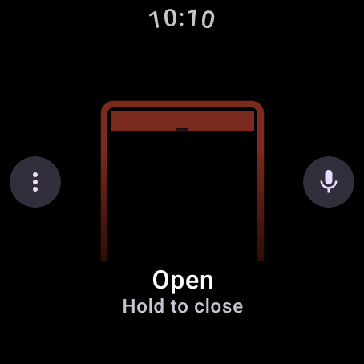 | Open door, "Hold to close" |
| signed_out | 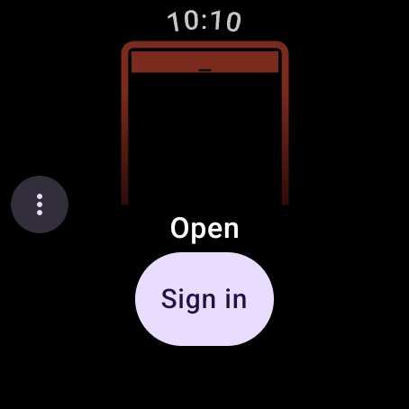 | Signed out: Sign in button (no mic chip — the voice demo is signed-in only) |
| sign_in_error | 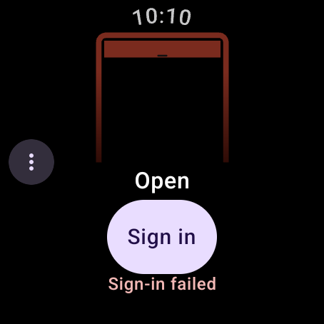 | Transient "Sign-in failed" caption |
| settings | 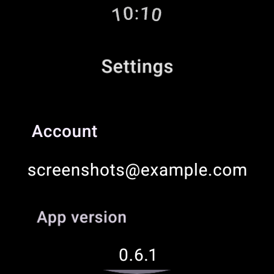 | Settings, one swipe left of the door: a scrolling list (crown included) with the signed-in account, the version, and an edge button to the store |
| settings_bottom | 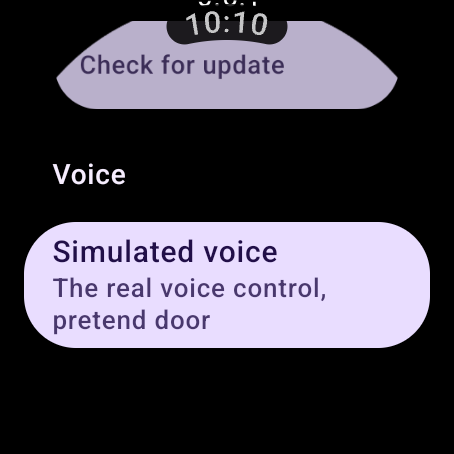 | The end of the same list, which a settle-then-capture fixture cannot otherwise reach: the update button is below the fold at scroll position 0 |
| settings_local | 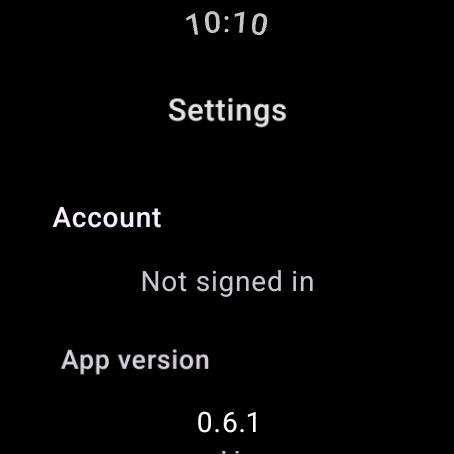 | The same list signed out and on a build that never came from a release, which is the one case that still names itself |
| voice_ready | 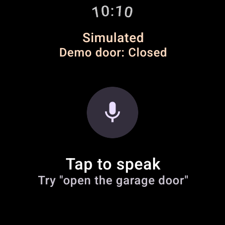 | Voice demo at rest: "Simulated" marker, "Tap to speak", demo door Closed |
| voice_listening | 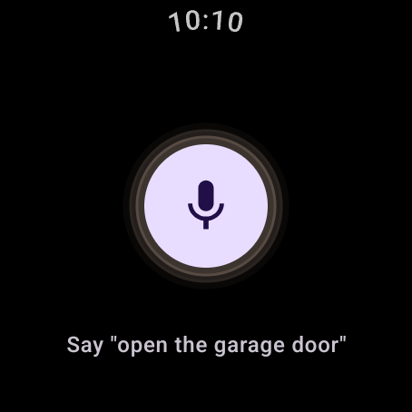 | Voice demo listening, nothing said yet: two lines total, and pulse rings capped so they clear both |
| voice_hearing | 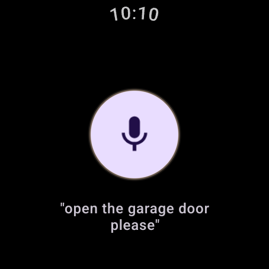 | Voice demo mid-utterance: rings driven by mic level, prompt replaced by ONE line of live text, ellipsized at the START so the newest words stay visible |
| voice_armed | 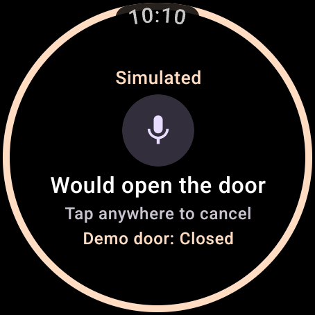 | Voice demo counting down: the action named conditionally, "Would open the door" |
| voice_committing | 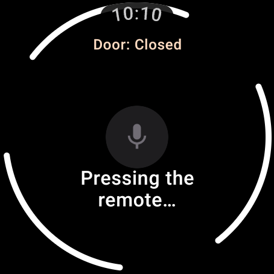 | Voice demo just after the commit: the hero screen's ring, post-bloom, holding complete (the bloom peak itself is the  stage — same component) |
| voice_sent | 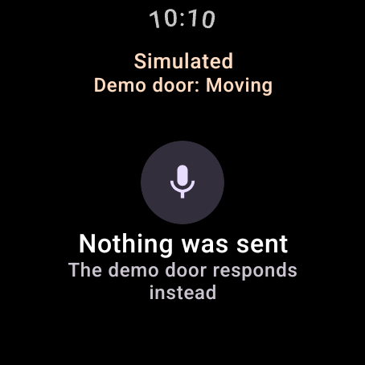 | Voice demo punchline: "Nothing was sent"; only the demo door reacts |
| voice_refused | 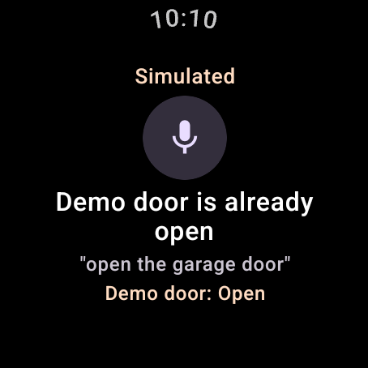 | Voice demo gate refusing a command the demo door has outgrown |
