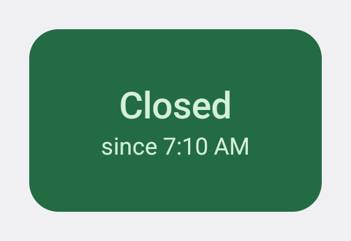
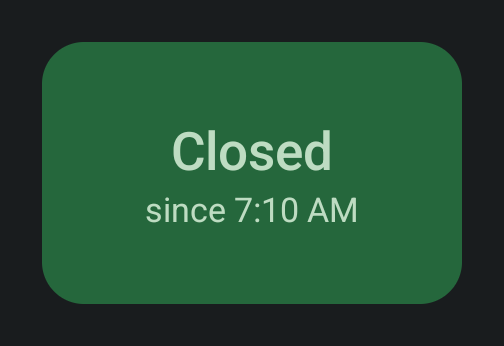
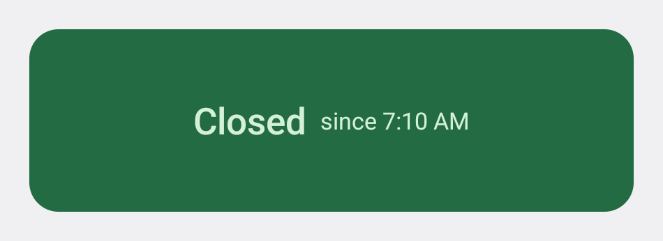
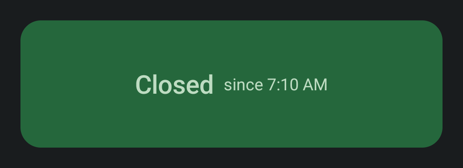
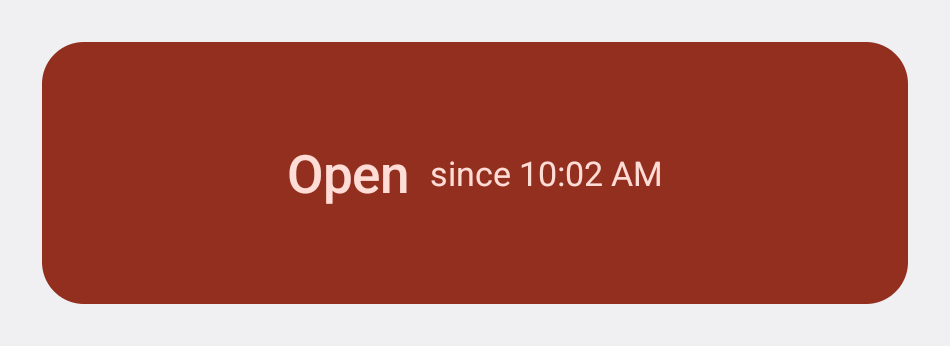
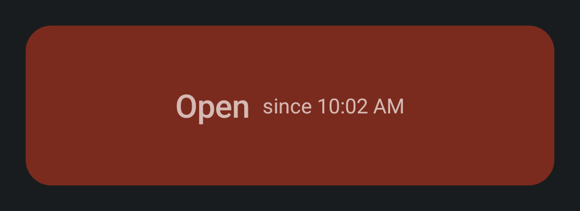
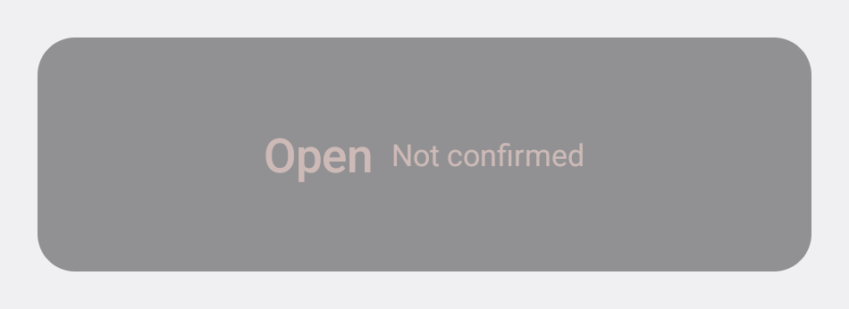
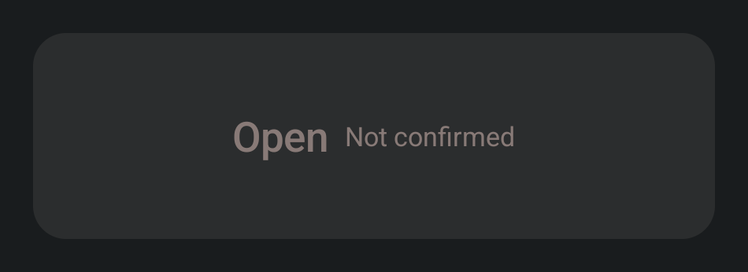
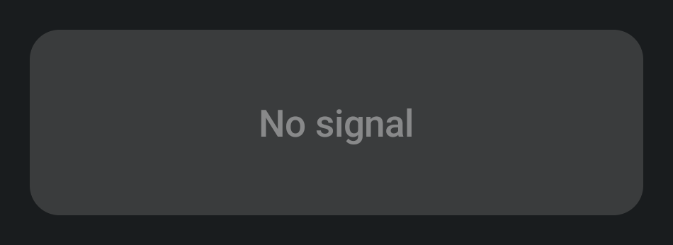

# Widget screenshots (generated — latest)

Auto-generated by `./scripts/generate-widget-screenshots.sh`; do not hand-edit.
Captured from the debug fixture `WidgetStagesActivity` on the
`widget_capture` emulator (pixel_7 profile, API 34 Google APIs image) with the
clock pinned to 10:10, in both themes. The fixture composes the widget to
RemoteViews at a launcher-sized cell for each size class (2x1: 160x100 dp,
4x1: 330x100 dp), inflates it, and copies exactly that frame plus a margin
off the rendered window, so each capture is what a launcher shows there.
`widget-closed_4x1-light.png` is also copied to
`androidApp/src/main/res/drawable-nodpi/garage_door_widget_preview.png`,
the picker image for launchers older than Android 15.

| Stage | Light | Dark | Shows |
|---|---|---|---|
| closed_2x1 |  |  | Two cells: the placement default. Headline over the since-line |
| closed_4x1 |  |  | Four cells: the same words on one row — GarageWidgetLayout's decision for a width at or past 250 dp. Its light capture is also the widget picker's image |
| open_4x1 |  |  | Open door, confirmed two minutes ago, open eight minutes. Review against stale_4x1 |
| stale_4x1 |  |  | Six hours since the garage last reported: the same open door, drained and dimmed, "Not confirmed" in place of a span |
| no_signal_4x1 |  |  | Nothing known and nothing reachable: "No signal", no second line at all |
