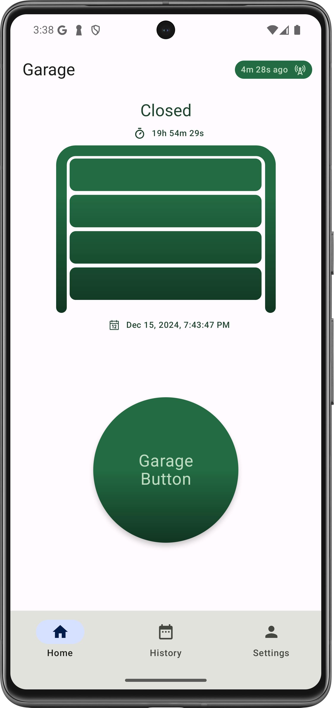

# Smart Garage Door
**Author:** Christopher Cartland

Smart garage door system built with ESP32 microcontroller, Firebase "serverless" backend, and Android app.

My original firmware implementation was based on Arduino (2021). I've since migrated to ESP32 and FreeRTOS (2024).

* 2021: Arduino on Adafruit HUZZAH32 - ESP32 Feather
* 2024: FreeRTOS on ESP32-DevKitC ESP32-WROOM-32U Development Board

## Table of Contents
* [Firmware](#firmware): ESP32 Firmware (FreeRTOS and Legacy Arduino)
* [Android](#android): Android app
* [Server](#server): Firebase Functions

 

## Firmware

### 2024 Implementation (ESP32 FreeRTOS)
Located in `GarageFirmware_ESP32/`, this version offers improved reliability through:
* FreeRTOS task management
* ESP-IDF native WiFi stack
* Structured project architecture with components
* Configurable fake implementations for testing
* Menuconfig for WiFi and server settings

**Hardware**:
* [ESP32-DevKitC ESP32-WROOM-32U Development Board](https://www.amazon.com/dp/B09KLS2YB3)
* [Adafruit Magnetic contact switch (door sensor)](https://www.adafruit.com/product/375)
* [Adafruit Non-Latching Mini Relay FeatherWing](https://www.adafruit.com/product/2895)

Key components:
* `garage_hal`: Hardware abstraction for sensors and button
* `door_sensors`: Manages door position sensors with debouncing
* `button_token`: Handles button press protocol with server
* `wifi_connector`: Manages WiFi connectivity
* `garage_http_client`: Handles HTTPS communication

### 2021 Implementation (Arduino ESP32)
The original Arduino-based implementation is preserved in `Arduino_ESP32/`. While still functional, it is considered legacy code.
Configuring the legacy code is more difficult because you need to manually change the WiFi credentials in the code.
This is one of the reasons I migrated to FreeRTOS with ESP-IDF, which supports menuconfig to set WiFi credentials.
You can browse the Arduino code in `Arduino_ESP32/`.

Contains:
* `DoorSensor/`: Code for monitoring door position
* `RemoteButton/`: Code for controlling the garage door button

**Legacy Hardware**:
* [Adafruit HUZZAH32 - ESP32 Feather](https://www.adafruit.com/product/3405)
* [Adafruit Magnetic contact switch (door sensor)](https://www.adafruit.com/product/375)
* [Adafruit Non-Latching Mini Relay FeatherWing](https://www.adafruit.com/product/2895)

## Android
* **Platform**: Android

**Door State**: The Android app displays the current status of the door, as interpreted by the server.
https://github.com/cartland/SmartGarageDoor/blob/027b1e2a5d79b8fe250d5ad6d3db659ceca11d0a/AndroidGarage/app/src/main/java/com/chriscartland/garage/door/DoorModel.kt#L37-L47

**Pushing the garage button**: The user can "press the garage door button" in the app.
After a second confirmation, the app will send a command to the server.
https://github.com/cartland/SmartGarageDoor/blob/027b1e2a5d79b8fe250d5ad6d3db659ceca11d0a/AndroidGarage/app/src/main/java/com/chriscartland/garage/remotebutton/RemoteButtonViewModel.kt#L230-L245

**Authentication**: Pushing the button requires Google Sign-In. The server maintains an allow-list.
https://github.com/cartland/SmartGarageDoor/blob/027b1e2a5d79b8fe250d5ad6d3db659ceca11d0a/AndroidGarage/app/src/main/java/com/chriscartland/garage/auth/AuthViewModel.kt#L71-L80

**Google Sign-In with Firebase Auth**: The app manages 2 distinct ID tokens. The server requires the Firebase version.
https://github.com/cartland/SmartGarageDoor/blob/027b1e2a5d79b8fe250d5ad6d3db659ceca11d0a/AndroidGarage/app/src/main/java/com/chriscartland/garage/auth/AuthRepository.kt#L69-L73

## Server
* **Platform**: Firebase Functions

**All critical logic is handled by the server**. To minimize client updates,
the clients have very little business logic encoded in them.

Non-server responsibilities:
* **Sensors**: Simply report sensor values to the server when the value change
* **Button**: Simply push the button based on a server command
* **Android**: View the current door state based on the server,
  and send a command to push the button based on user request.

As long as the primitive requirements are supported by the clients, the server can add new features.
* **Server**
  * **Stores all requests** sent by clients.
  https://github.com/cartland/SmartGarageDoor/blob/b5799199b19d8aabdc6f329a40eeae4fd10e3e3d/FirebaseServer/src/index.ts#L65
  * Interprets sensor data and converts signal input to **door events**.
  https://github.com/cartland/SmartGarageDoor/blob/b5799199b19d8aabdc6f329a40eeae4fd10e3e3d/FirebaseServer/src/index.ts#L77
  * Responds to client requests for the **current event**.
  https://github.com/cartland/SmartGarageDoor/blob/b5799199b19d8aabdc6f329a40eeae4fd10e3e3d/FirebaseServer/src/index.ts#L97
  * Implements the Button Ack Token Protocol to **push the garage remote button**.
  https://github.com/cartland/SmartGarageDoor/blob/b5799199b19d8aabdc6f329a40eeae4fd10e3e3d/FirebaseServer/src/index.ts#L149
  * Listens to **Android app requests to push the button**.
  https://github.com/cartland/SmartGarageDoor/blob/b5799199b19d8aabdc6f329a40eeae4fd10e3e3d/FirebaseServer/src/index.ts#L160
  * **Checks for garage door errors** every minute (example: door halfway closed).
  https://github.com/cartland/SmartGarageDoor/blob/b5799199b19d8aabdc6f329a40eeae4fd10e3e3d/FirebaseServer/src/index.ts#L117
  * **Checks for open garage door** every 5 minutes, and **sends a mobile notification** if the door is **open more than 15 minutes**.
  https://github.com/cartland/SmartGarageDoor/blob/b5799199b19d8aabdc6f329a40eeae4fd10e3e3d/FirebaseServer/src/index.ts#L128
  https://github.com/cartland/SmartGarageDoor/blob/b5799199b19d8aabdc6f329a40eeae4fd10e3e3d/FirebaseServer/src/index.ts#L137
  * Implements a **data retention policy** to delete old data.
  https://github.com/cartland/SmartGarageDoor/blob/b5799199b19d8aabdc6f329a40eeae4fd10e3e3d/FirebaseServer/src/index.ts#L182

## Limitations
* **Root CA Expiration**: The server uses a hard-coded root CA that expires in 2036.
* **Polling**: Polling is more expensive and has high latency.
  * I could improve latency with a server-only change. The idea is to wait during
    the polling period to see if a button press should happen,
    and respond immediately to the client. This requires testing to make sure
    the client doesn't timeout. I haven't prioritized this because the polling
    only costs about $1 per month, which is cheap enough for my use case.
* **Button press race condition**: If the device crashes immediately
  after successfully pressing the button but before sending the `buttonAckToken`
  to the server, the client might push the button more than once.
* **Reset recovery in FreeRTOS**: The FreeRTOS implementation hasn't been tested
  with a hard reset. The Arduino implementation has been tested for 3.5 years,
  and it contains a physical reset wire that is triggered when there is an issue.
  I need to implement recovery logic for the FreeRTOS implementation.

## License
This project is licensed under the Apache 2.0 License - see the [LICENSE](LICENSE) file for details.

---

# Acknowledgments
Below are some of the main resources that helped me create this project.
Adafruit has amazing products and educational materials.

## Feather
* https://learn.adafruit.com/adafruit-huzzah32-esp32-feather/using-with-arduino-ide
* https://github.com/espressif/arduino-esp32/blob/master/docs/arduino-ide/boards_manager.md
* https://www.silabs.com/developers/usb-to-uart-bridge-vcp-drivers

## Arduino IDE
* Board
  * https://raw.githubusercontent.com/espressif/arduino-esp32/gh-pages/package_esp32_index.json
  * Board: ESP32 -> Adafruit ESP32 Feather
* Port: cu.SLAB_USBtoUART

## AirLift
* https://learn.adafruit.com/adafruit-metro-m4-express-airlift-wifi/update-the-uf2-bootloader

## ESP32
* Update firmware https://learn.adafruit.com/upgrading-esp32-firmware/overview
  * https://learn.adafruit.com/upgrading-esp32-firmware/upgrade-an-airlift-all-in-one-board
 
## Reset Arduino in Software
* https://www.instructables.com/two-ways-to-reset-arduino-in-software/
